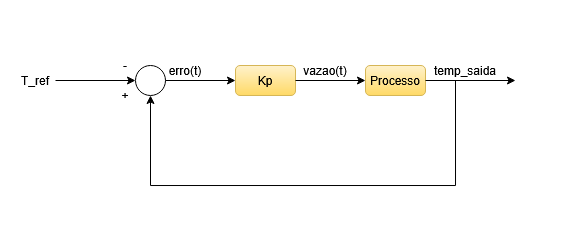

# 🌞 Simulador de Coletor Solar com Controle de Vazão

Este projeto simula o funcionamento de um coletor solar térmico plano com controle automático de vazão para manter a temperatura de saída próxima a uma temperatura de referência.

##  Equações do Modelo Físico

###  Temperatura de Saída

O balanço de energia no coletor solar é representado por:

$$
Q_u = F_r \cdot A \cdot \left[ G \cdot \eta_o - U_L \cdot (T_{entrada} - T_{ambiente}) \right]
$$

A temperatura de saída é calculada como:

$$
T_{saida} = T_{entrada} + \frac{Q_u}{\dot{m} \cdot c_p}
$$

Onde:
- \(Q_u\) = Energia útil (W)
- \(F_r\) = Fator de remoção de calor (adimensional)
- \(A\) = Área do coletor (m²)
- \(G\) = Irradiação solar (W/m²)
- \(η\) = Eficiência óptica
- \(U_L\) = Coeficiente de perda térmica (W/m²·°C)
- \(T_entrada\) = Temperatura de entrada (°C)
- \(T_ambiente\) = Temperatura ambiente (°C)
- \(m\) = Vazão mássica (kg/s)
- \(c_p\) = Calor específico da água (4186 J/kg·°C)
   
> 💡 A vazão em L/s é convertida diretamente para kg/s considerando a densidade da água ≈ 1000 kg/m³.

---

## 🧠 Controle de Vazão (Controle Proporcional com Faixa Morta)

### 🔧 Equações do Controle:

- Erro:

$$
erro = T_{saida} - T_{referencia}
$$

- Ajuste proporcional:

$$
ajuste = K_p \cdot erro
$$

- Nova vazão:

$$
vazao_{nova} = vazao_{atual} + ajuste
$$

- Aplicação dos limites:

$$
vazao_{nova} = \min(100, \max(10, vazao_{nova}))
$$

> Se \( |erro| < faixa \) (ex.: 0.5°C), a vazão não é ajustada.

---

## 🎯 Objetivo do Controle

O controlador proporcional ajusta a vazão da água para que a temperatura de saída se mantenha próxima de uma temperatura de referência. Quando a temperatura de saída se afasta da referência, a vazão é ajustada proporcionalmente, respeitando os limites mínimo (10%) e máximo (100%).

---

## 🖼️ Ilustração do Sistema

---

## 🚀 Como Executar

1. Clone este repositório.
2. Compile e execute o arquivo principal no NetBeans ou outro ambiente Java.
3. Ajuste os parâmetros de irradiância, temperatura ambiente, e temperatura de referência para observar o comportamento do sistema.

---

## 📜 Licença

Este projeto está sob a licença MIT.

---
_Desenvolvido por Davi de Lima Rosa_
---
